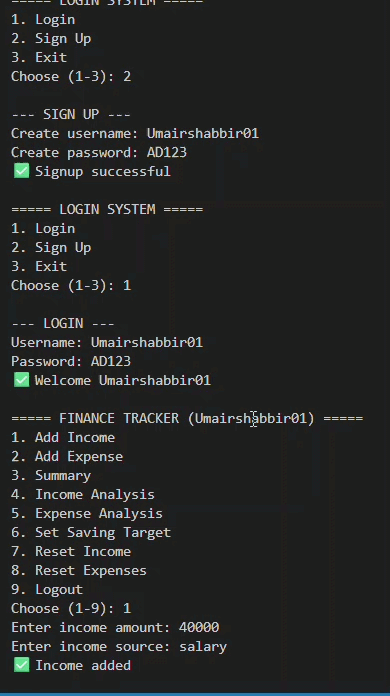

# AI Personal Finance Tracker (Multi-User System)

A command-line personal finance management system built in Python, supporting multiple users with isolated data, automatic expense categorization, and real-time saving alerts.


---

## Demo



---

## Overview

Most beginner finance trackers are single-user and don't account for risky spending behavior. This project addresses both gaps: a login-based system where each user's financial data is kept completely separate, combined with rule-based logic that automatically categorizes expenses and warns users in real time when they start dipping into their savings.

Built as part of my BSAI coursework in Artificial Intelligence, this project applies rule-based AI logic to a practical, everyday problem.

---

## Key Features

| # | Feature |
|---|---|
| 1 | User login & signup system |
| 2 | Multi-user support with fully separate data per user |
| 3 | Income management, tracked by source |
| 4 | Expense management with automatic category detection |
| 5 | Dedicated "Academic Fees" category for student use cases |
| 6 | Saving target setting |
| 7 | Real-time, non-blocking saving alerts |
| 8 | Income & expense analysis and breakdown |
| 9 | Independent reset options for income and expenses |
| 10 | CSV-based data storage — no external database required |

---

## AI Logic

This project uses **rule-based AI logic** to automate financial decision-making:

- **Category detection** — expense descriptions are matched against keyword rules to automatically classify spending (e.g. "pizza" → Food, "uber" → Transport)
- **Saving alerts** — the system continuously monitors the gap between income and expenses, and triggers a warning the moment a user starts spending into their saving target
- **Financial rule enforcement** — expenses cannot be logged before income is recorded, mirroring real-world budgeting discipline

---

## Tech Stack

| Component | Technology |
|---|---|
| Language | Python 3 |
| IDE | Visual Studio Code |
| Data Storage | CSV & plain text files |
| Interface | Command-line (CLI) |

No external libraries are required — the entire project runs on Python's standard library (`csv`, `os`, `datetime`).

---

## Project Structure

```
AI-Personal-Finance-Tracker/
│
├── main.py                  Main program — login system, menus, all core logic
├── sample_data.csv          Sample transaction data for reference
├── assets/
│   └── demo.gif             Demo recording
├── README.md
├── LICENSE
└── .gitignore

# Generated at runtime (excluded from version control):
├── users.txt                 User credentials
├── data_<username>.csv        Per-user income & expense log
└── saving_<username>.txt      Per-user saving target
```

---

## Getting Started

**Requirements:** Python 3 installed on your machine.

```bash
# 1. Clone the repository
git clone https://github.com/umairshabbirr/AI-Personal-Finance-Tracker.git
cd AI-Personal-Finance-Tracker

# 2. Run the program
python main.py
```

Then:
1. Sign up with a new username and password
2. Log in
3. Use the menu to add income, log expenses, set a saving target, and view your analysis

---

## Future Improvements

- [ ] Replace plaintext password storage with proper hashing
- [ ] Add graphical charts for expense analysis (Matplotlib)
- [ ] Generate monthly PDF reports
- [ ] Replace rule-based categorization with a trained ML text classifier
- [ ] Build a web or mobile front-end

---

## Author

**Muhammad Umair**
BSAI Student — Artificial Intelligence Coursework Project
[LinkedIn](https://linkedin.com/in/umairshabbirr) · [GitHub](https://github.com/umairshabbirr)

---

## License

This project is licensed under the [MIT License](LICENSE).
